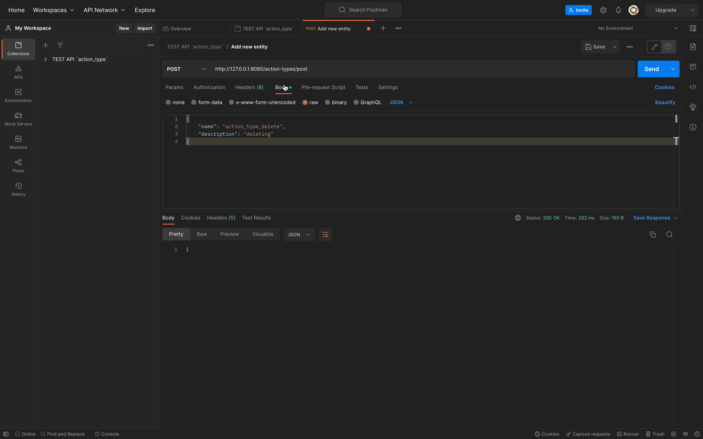
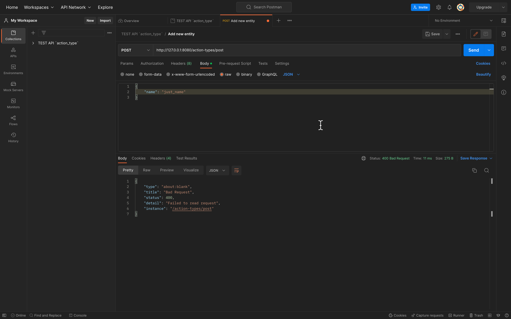
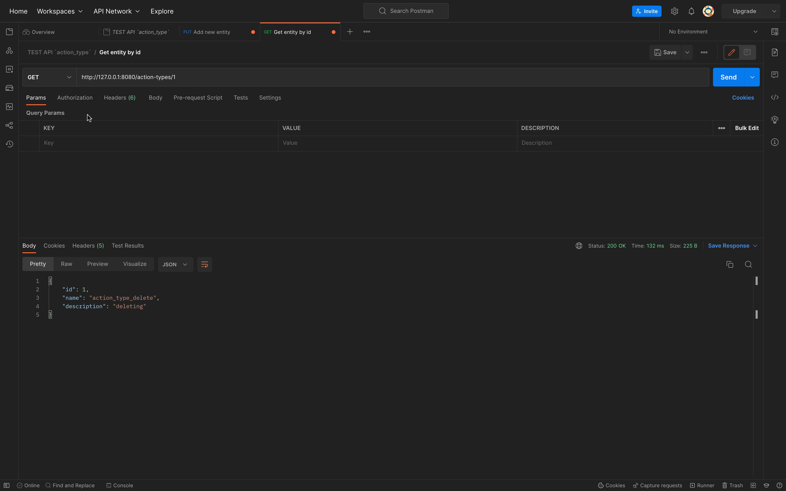
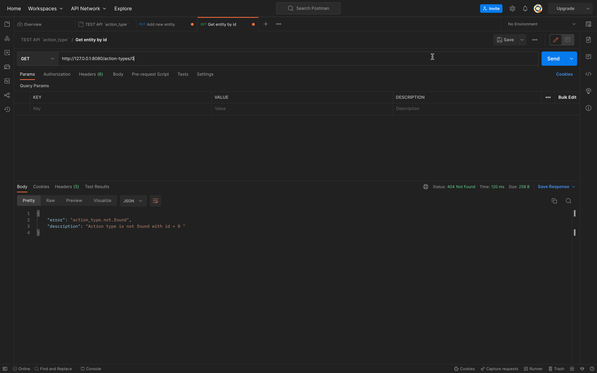
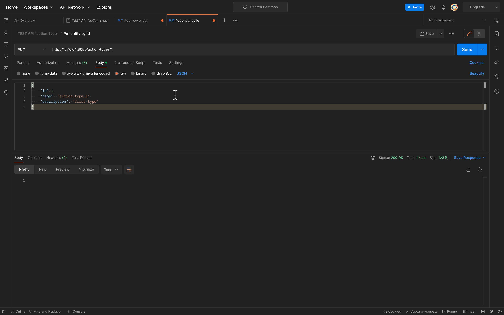
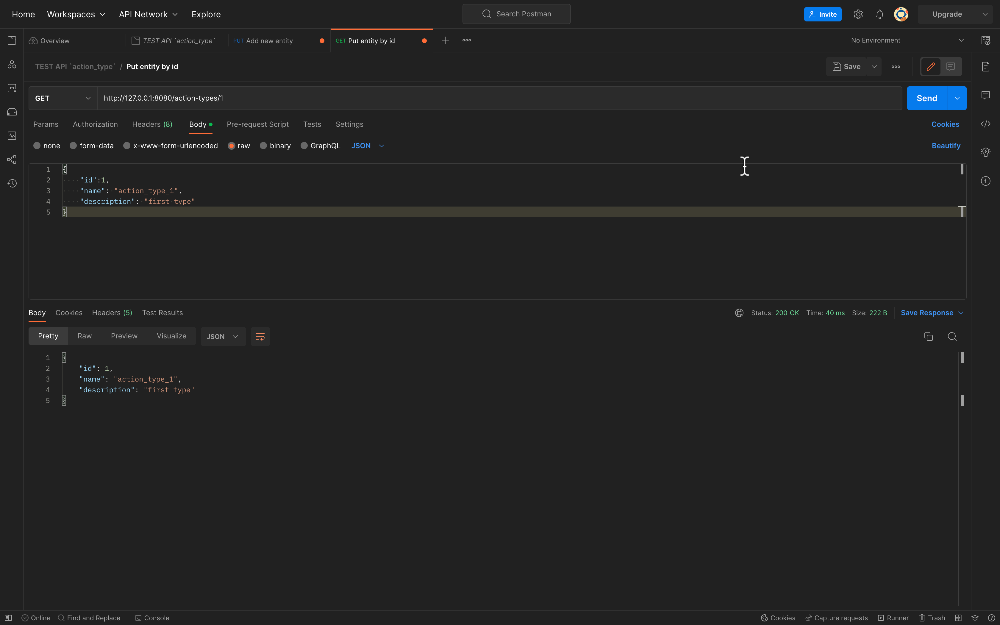
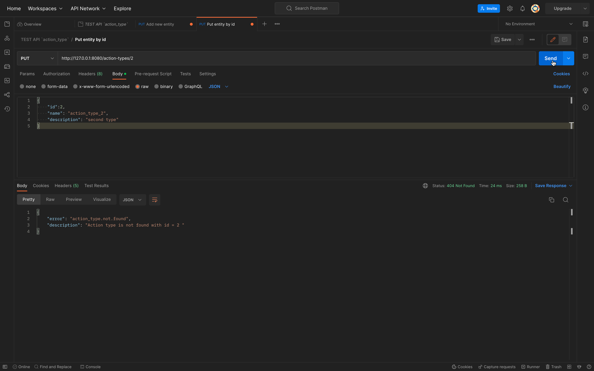
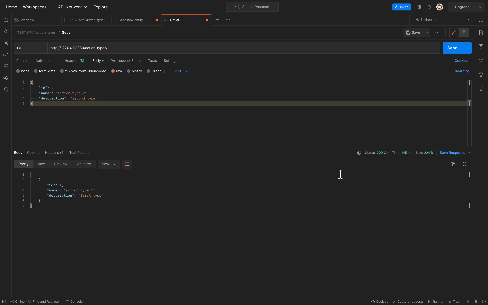
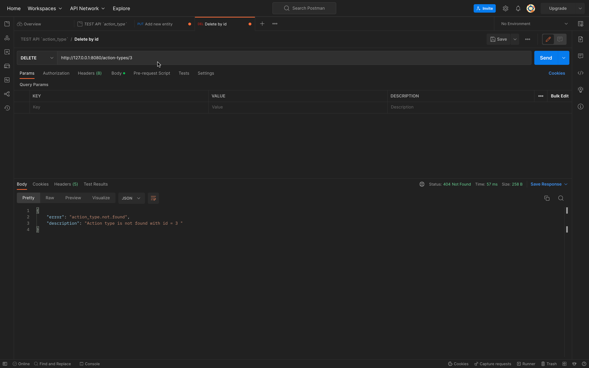
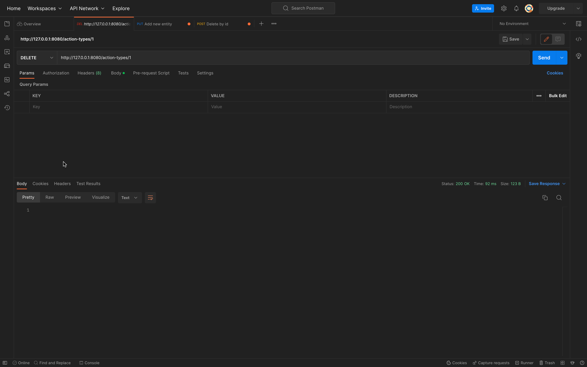

# Тестування працездатності системи

*В цьому розділі необхідно вказати засоби тестування, навести вихідні коди тестів та результати тестування.*

*Використовувався Postman*

----

## Перший POST запит - створення нового рядка (id=1 повернулось як відповідь):

  

## POST запит - створення нового рядка з недостатньою кількістю полів:

  

## GET запит по існуючому id:

  

## GET запит по неіснуючому id:

  

## PUT запит - зміна поля певного рядка:

  

## GET запит - підтвердження оновлення рядка

  

## PUT запит - зміна поля певного рядка по неіснуючому id:

  

## GET запит - зчитування усієї таблиці (1 рядок): 

  

## DELETE запит по неіснуючому id:

  

## DELETE запит по існуючому id:

  

## Останній GET запит (порожня таблиця - Status 204 No Content ): 

  

